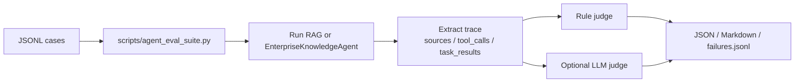

# 统一评测脚本使用说明

`scripts/agent_eval_suite.py` 是当前项目唯一推荐的评测主线。它把 RAG 评测、工具调用评测、端到端 Agent 评测放在一个入口里，同时支持程序规则评测和 LLM-as-judge。

## 评测链路



## 基本命令

查看参数：

```bash
python scripts/agent_eval_suite.py --help
```

运行 RAG 评测：

```bash
python scripts/agent_eval_suite.py \
  --suite rag \
  --questions eval/rag_clean_eval_set/rag_clean_questions.jsonl \
  --mode hybrid \
  --judge rule \
  --output outputs/eval/rag_eval_report
```

运行工具调用评测：

```bash
python scripts/agent_eval_suite.py \
  --suite tool \
  --questions eval/agent_eval_cases_full/tool_eval_cases.jsonl \
  --judge rule \
  --output outputs/eval/tool_eval_report
```

运行端到端 Agent 评测：

```bash
python scripts/agent_eval_suite.py \
  --suite e2e \
  --questions eval/agent_eval_cases_full/agent_e2e_eval_cases.jsonl \
  --judge both \
  --output outputs/eval/e2e_eval_report
```

一次运行全部评测：

```bash
python scripts/agent_eval_suite.py \
  --suite all \
  --rag-questions eval/rag_clean_eval_set/rag_clean_questions.jsonl \
  --tool-questions eval/agent_eval_cases_full/tool_eval_cases.jsonl \
  --e2e-questions eval/agent_eval_cases_full/agent_e2e_eval_cases.jsonl \
  --judge both \
  --output outputs/eval/full_eval_report
```

## 常用参数

| 参数 | 说明 |
|---|---|
| `--suite` | `rag`、`tool`、`e2e`、`all` |
| `--judge` | `rule`、`llm`、`both`，默认 `rule` |
| `--mode` | `vector`、`hybrid`、`hybrid_rerank`，主要影响 RAG 检索 |
| `--questions` | 单 suite 模式的问题集 |
| `--rag-questions` | `--suite all` 时的 RAG 问题集 |
| `--tool-questions` | `--suite all` 时的工具问题集 |
| `--e2e-questions` | `--suite all` 时的端到端问题集 |
| `--limit` | 只运行前 N 条，适合 smoke test |
| `--case-id` | 只运行指定 case |
| `--role` | 默认角色；case 内 `role` 优先 |
| `--output` | 输出路径前缀，不带后缀 |
| `--dry-run` | 只打印将要执行的 case，不调用模型 |
| `--verbose` | 打印每条 case 的 route、tool_calls、sources 和失败原因 |
| `--llm-judge-model` | 单独指定 judge 模型；不传则用项目默认控制模型 |

## 输出文件

假设 `--output outputs/eval/smoke_rag`，会生成：

```text
outputs/eval/smoke_rag.json
outputs/eval/smoke_rag.md
outputs/eval/smoke_rag_failures.jsonl
```

JSON 报告保留完整结构化结果，Markdown 报告适合人工复盘，`failures.jsonl` 适合后续做失败样本分析。

## 三类评测看什么

### RAG

规则评测关注：

- `Recall@K`：检索来源是否命中 `expected_sources`
- `Citation Hit`：最终答案是否提到期望来源文件名
- `Refusal Hit`：应拒答的问题是否拒答，不应拒答的问题是否没有误拒
- 平均延迟和 P95 延迟

LLM judge 只补充判断答案质量，不替代 source recall。

### Tool

规则评测直接读取 trace：

- route 是否正确
- tool/action 是否正确
- tool sequence 是否符合预期
- tool args 是否包含 `must_have_args`
- 是否出现禁止参数，例如 `event_id=all`
- 非 admin 写操作是否被拒绝
- create/update/delete 是否真的成功，而不是只在自然语言里说成功
- 最终回答是否满足 `must_contain` / `must_not_contain`

### E2E

端到端评测看完整链路：

- 多任务是否漏执行
- 预期工具是否覆盖
- RAG 是否有来源
- 工具答案是否基于工具结果
- 最终回答是否覆盖所有用户目标
- 是否出现幻觉或错误拒答

## Case 格式示例

RAG case：

```json
{"id":"rag_001","question":"报销时限是多少？","expected_sources":["finance_01_reimbursement_policy.md"],"should_refuse":false,"expected_answer_points":["30天内提交"]}
```

工具 case：

```json
{
  "id": "tool_calendar_update_001",
  "role": "admin",
  "question": "把第一个公司团建改成公司高层会议，时间晚上九点到十点，地点会议室A",
  "expected": {
    "route": "tool",
    "tool": "manage_company_calendar",
    "action": "update",
    "tool_sequence": [["manage_company_calendar", "query"], ["manage_company_calendar", "update"]],
    "must_have_args": {"title": "公司高层会议", "time": "21:00-22:00", "location": "会议室A"},
    "must_not_have_args": {"event_id": "all"},
    "should_write": true,
    "should_refuse": false
  }
}
```

## Smoke Test

建议改完 Agent 或工具后先跑小样本：

```bash
python scripts/agent_eval_suite.py \
  --suite rag \
  --questions eval/rag_clean_eval_set/rag_clean_questions.jsonl \
  --judge rule \
  --limit 3 \
  --output outputs/eval/smoke_rag
```

```bash
python scripts/agent_eval_suite.py \
  --suite tool \
  --questions eval/agent_eval_cases_full/tool_eval_cases.jsonl \
  --judge rule \
  --limit 3 \
  --output outputs/eval/smoke_tool
```

如果报告里所有 case 都是 `Connection error.`，优先检查 `.env` 中的 `DASHSCOPE_API_KEY`、`QWEN_BASE_URL`、模型名和当前网络。

## 状态隔离

工具和端到端 case 可能写入 `data/business/company_calendar.json`。脚本会在每条 case 前备份常见本地数据文件，case 结束后恢复，避免评测污染演示数据。

当前备份范围包括：

- `data/business/company_calendar.json`
- `data/business/attendance.csv`
- 若存在，也会尝试备份旧路径 `data/company_calendar.json`、`data/tools/company_calendar.json`、`data/daily/company_calendar.json`

## 当前主线与归档

旧 `scripts/eval.py`、旧 `scripts/retrieval_ablation.py`、旧 `mini_rag.eval` 和旧脚本式 Agent 已移动到 `old/`。当前 README、面试讲解和后续优化应统一围绕：

- `src/mini_rag/graph/`
- `src/mini_rag/agent/agent.py`
- `scripts/agent_eval_suite.py`
- `eval/agent_eval_cases_full/`
- `eval/rag_clean_eval_set/rag_clean_questions.jsonl`
